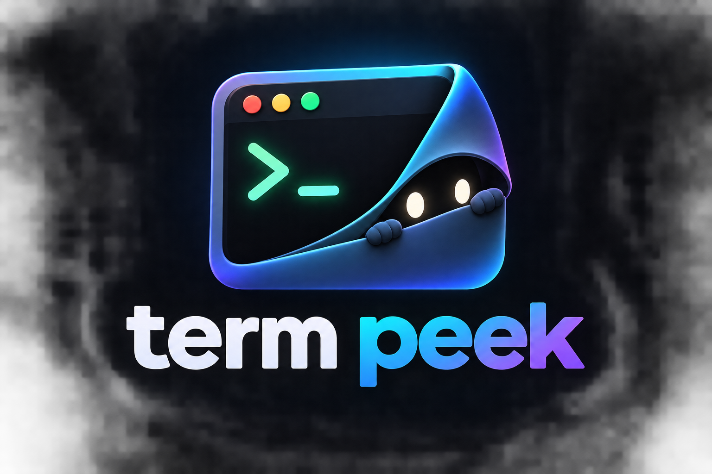

<p align="center">
  
</p>

# termpeek

Live type-ahead command history search for Zsh.

When you type a keyword in your terminal, matching commands from your history appear directly below your prompt. You can navigate through them, fill the prompt with Tab or Right Arrow, run immediately with Enter, or dismiss with Escape.

## Why it exists

Shell history tools usually fall into two categories:

1. **Inline ghost suggestions** (like `zsh-autosuggestions`): Fast, but only match from the start of the command line. If you type `workspace`, it misses `cd workspace` or `python run.py --dir workspace`.
2. **Modal search popups** (like `fzf` or `atuin`): Useful, but you have to interrupt your typing, hit a hotkey (`Ctrl+R`), search in a separate box, and exit back to the prompt.

`termpeek` bridges the gap. As you type regular commands, it looks through your history for matches containing that keyword and displays matching commands underneath.

## Developer features

`termpeek` includes features built specifically for daily engineering workflows:

- **Project Task Discovery (`[project]`)**: Whenever you enter a directory, `termpeek` inspects `package.json`, `Makefile`, `Cargo.toml`, `docker-compose.yml`, or `pyproject.toml`. If you type `test`, `dev`, `build`, `lint`, or `run`, your repository scripts appear directly in your suggestions without having to open the config file.
- **Destructive Command Blast-Radius Guard (`[DANGER]`)**: High-risk operations (such as `rm -rf`, `git reset --hard`, `git push --force`, `git clean -fd`, `kubectl delete`) receive a prominent `[DANGER]` badge. Pressing Enter on a dangerous suggestion never executes it directly; instead, it safely loads the command onto your prompt line with a review prompt so you can inspect the blast radius before running.
- **Screen-Share Privacy & Secret Sanitization (`[SECRET]`)**: When sharing your screen, pairing, or recording, typing keywords will not leak sensitive credentials. API keys (OpenAI, Anthropic, GitHub, AWS, Stripe), Bearer tokens, and passwords found in history are automatically masked in the display list (`sk-...****[REDACTED]`).
- **Directory-scoped ranking**: Commands previously executed inside the current folder or git repository root get a score boost, floating project-specific commands to the top.
- **Frecency weighting**: Blends frequency and recency scoring so commands you run often stay near the top without burying your newest runs.
- **Exit-code filtering**: Ignores commands that failed with non-zero exit codes by default, keeping mistyped syntax and typos out of your suggestions.
- **Recipe cheatsheets (`[recipe]`)**: When your history has fewer matches than your display limit, common syntax templates (like `tar`, `rsync`, `ffmpeg`, `docker`, `find`, `curl`, `chmod`, `lsof`) fill the remaining slots.
- **Non-destructive browsing**: Moving through suggestions with Down and Up arrow keys never replaces what you typed. Your prompt stays clean, and your undo history stays intact.
- **Dual completion keys**:
  - Press **Tab** to fill the prompt with the currently highlighted command (or the top match if none is highlighted).
  - Press **Right Arrow (`→`)** to immediately fill the prompt with the **first command on the list**, even if you have navigated down.
- **Enter to run**: Pressing Enter on a highlighted safe suggestion runs it immediately. If nothing is highlighted, it runs what you typed.
- **Escape to dismiss**: Pressing Escape hides suggestions so you can keep typing without distraction.
- **Normal history untouched**: When your prompt is empty or no suggestions are highlighted, Up and Down arrows work as standard shell history navigation.

## Controls

| Key | Action |
| :--- | :--- |
| **Type (2+ chars)** | Searches history and displays matches below the prompt |
| **Down Arrow (`↓`)** | Move pointer down through suggestions |
| **Up Arrow (`↑`)** | Move pointer up through suggestions (returns to shell history at top) |
| **Tab** | Fill prompt with highlighted command to edit (or top match if none highlighted) |
| **Right Arrow (`→`)** | Fill prompt with the first command on the list |
| **Enter** | Run highlighted safe command immediately (loads dangerous command for review) |
| **Escape** | Close suggestions and keep typing |
| **Up Arrow (empty prompt)** | Standard shell history |

## Configuration

You can customize `termpeek` by setting these environment variables in your `~/.zshrc` before sourcing the script:

```bash
# Maximum number of suggestions to display (default: 4)
export TERMPEEK_MAX_RESULTS=4

# Selection pointer icon (default: ▶)
export TERMPEEK_POINTER="▶"

# Show navigation hints next to suggestions (1 = show, 0 = hide, default: 1)
export TERMPEEK_SHOW_HINTS=1

# Only suggest commands that succeeded with exit code 0 or -1 (default: 1)
export TERMPEEK_ONLY_SUCCESSFUL=1

# Show built-in recipe cheatsheets when history has few matches (default: 1)
export TERMPEEK_RECIPES=1

# Discover local project tasks from package.json, Makefile, Cargo.toml, etc. (default: 1)
export TERMPEEK_PROJECT_TASKS=1

# Flag destructive commands with [DANGER] and require confirmation (default: 1)
export TERMPEEK_SAFETY_GUARD=1

# Mask API keys and secrets in suggestion display for screen-share privacy (default: 1)
export TERMPEEK_MASK_SECRETS=1
```

## Installation

### Manual

Clone this repository:

```bash
git clone https://github.com/zerakjamil/termpeek.git ~/.termpeek
```

Add this line to your `~/.zshrc`:

```bash
source ~/.termpeek/termpeek.zsh
```

Then reload your shell:

```bash
exec zsh
```

### Oh My Zsh

1. Clone into your custom plugins directory:
   ```bash
   git clone https://github.com/zerakjamil/termpeek.git ${ZSH_CUSTOM:-~/.oh-my-zsh/custom}/plugins/termpeek
   ```
2. Add `termpeek` to the plugins list in your `~/.zshrc`:
   ```bash
   plugins=(... termpeek)
   ```

### Zinit

Add this to your `~/.zshrc`:

```bash
zinit light zerakjamil/termpeek
```

## History backends

`termpeek` works out of the box with standard Zsh history (`~/.zsh_history`).

If you use [Atuin](https://github.com/atuinsh/atuin), `termpeek` automatically detects its SQLite database (`~/.local/share/atuin/history.db`) for directory-scoped scoring, exit-code filtering, and sub-millisecond lookups across all terminal tabs.

## Running tests

Run the included test script to verify widgets, completion logic, safety guards, and state transitions:

```bash
./tests/test_termpeek.zsh
```

## License

MIT
